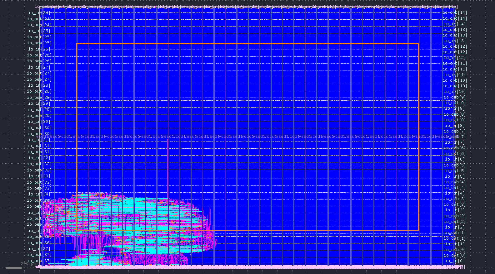

# FIR Accelerator Caravel SoC

[](https://opensource.org/licenses/Apache-2.0)
[](https://github.com/google/skywater-pdk)
[](https://github.com/efabless/caravel)

A digital signal processing SoC implemented in the Caravel open-source chip framework on the SkyWater SKY130A 130nm process. The design implements a complete fixed-point DSP pipeline: a configurable CIC decimation filter feeding an 8-tap FIR filter with runtime-programmable coefficients, driving a first-order delta-sigma PWM DAC output. The entire pipeline is controlled by the Caravel RISC-V management core via a Wishbone-mapped CSR block.

---

## Table of Contents

- [Theory](#theory)
  - [Signal Processing Pipeline](#signal-processing-pipeline)
  - [CIC Decimation Filter](#cic-decimation-filter)
  - [FIR Filter](#fir-filter)
  - [PWM DAC](#pwm-dac)
  - [Fixed-Point Arithmetic](#fixed-point-arithmetic)
- [Architecture](#architecture)
  - [Block Diagram](#block-diagram)
  - [Blocks](#blocks)
  - [GPIO Mapping](#gpio-mapping)
  - [Register Map](#register-map)
- [Repository Structure](#repository-structure)
- [Setup](#setup)
- [Simulation](#simulation)
- [Hardening](#hardening)
- [Signoff Results](#signoff-results)
- [Layout](#layout)
- [Future Work](#future-work)

---

## Theory

### Signal Processing Pipeline

The design targets a common embedded DSP use case: a high-rate 1-bit bitstream input (as produced by a sigma-delta ADC) is decimated to a lower sample rate, digitally filtered, and converted back to an analog-approximated output via a PWM DAC.

The pipeline follows a three-stage structure:

```
fs_high (1-bit) --> [CIC] --> fs_low (N-bit) --> [FIR] --> [PWM DAC] --> analog approx.
```

Where `fs_high / fs_low = OSR` (oversampling ratio), configurable as 8, 16, 32, or 64.

---

### CIC Decimation Filter

A Cascaded Integrator-Comb (CIC) filter is an efficient multi-rate filter requiring no multipliers. For a 3-stage CIC with decimation ratio `R`, the transfer function is:

$$H(z) = \left( \frac{1 - z^{-R}}{1 - z^{-1}} \right)^3$$

The magnitude response in the continuous frequency domain is:

$$|H(f)| = \left| \frac{\sin(\pi f R / f_s)}{\sin(\pi f / f_s)} \right|^3$$

The filter consists of two sections operating at different sample rates:

**Integrators** (running at input rate `fs_high`):

$$y_k[n] = y_k[n-1] + y_{k-1}[n], \quad k = 1, 2, 3$$

where `y_0[n] = x[n]` (the input bitstream, mapped to {0, 1}).

**Comb sections** (running at output rate `fs_low = fs_high / R`):

$$c_k[m] = c_{k-1}[m] - c_{k-1}[m-1], \quad k = 1, 2, 3$$

The output word width grows as:

$$B_{out} = B_{in} + N \cdot \log_2(R)$$

For a 1-bit input, 3 stages, and OSR=16: `B_out = 1 + 3 * 4 = 13 bits`. The implementation uses 16-bit registers to provide headroom.

The DC gain of the CIC for a full-scale input (all-ones bitstream) is:

$$G_{DC} = R^N = 16^3 = 4096$$

which matches the simulation result (DC input settling to 4096).

---

### FIR Filter

A finite impulse response (FIR) filter computes a weighted sum of the current and past `N-1` input samples:

$$y[n] = \sum_{k=0}^{N-1} h[k] \cdot x[n-k]$$

where `h[k]` are the filter coefficients (tap weights) and `x[n]` is the input sequence.

For an 8-tap direct-form I implementation:

$$y[n] = h[0]x[n] + h[1]x[n-1] + h[2]x[n-2] + \cdots + h[7]x[n-7]$$

Key properties:

- **Linear phase**: For symmetric coefficients `h[k] = h[N-1-k]`, the filter has exactly linear phase — all frequencies are delayed by the same number of samples.
- **Unconditionally stable**: FIR filters have no feedback, so they cannot become unstable regardless of coefficient values.
- **Programmable**: Coefficients are written at runtime via the Wishbone CSR, allowing the same hardware to implement different filter responses (lowpass, bandpass, notch) without reconfiguration.

The step response of an `N`-tap moving average (all coefficients = `1/N`) ramps linearly from 0 to full scale over exactly `N` output samples, confirmed by the simulation results.

---

### PWM DAC

The PWM DAC implements a first-order delta-sigma modulator in the digital domain. Given an 8-bit input value `d`, the output bitstream `y[n]` has a long-run average equal to `d / 256`:

$$\bar{y} = \frac{d}{2^8}$$

The accumulator operates as:

$$acc[n] = (acc[n-1] + d) \bmod 2^8$$
$$y[n] = \text{carry out of } acc[n]$$

This produces a PWM bitstream with duty cycle proportional to `d`. At 40 MHz, the effective PWM frequency is approximately 156 kHz. A simple RC lowpass filter on the output pin recovers the analog voltage.

| Input `d` | Duty cycle | Analog output (3.3V supply) |
|---|---|---|
| `0x00` | 0% | 0.0 V |
| `0x80` | 50% | 1.65 V |
| `0xFF` | 99.6% | 3.29 V |

---

### Fixed-Point Arithmetic

All arithmetic uses Q1.15 fixed-point format for FIR coefficients:

$$x_{real} = \frac{x_{int}}{2^{15}} = \frac{x_{int}}{32768}$$

where `x_int` is the 16-bit signed integer representation.

| Value | Q1.15 hex | Decimal equivalent |
|---|---|---|
| 1.0 (max) | `0x7FFF` | 32767 / 32768 |
| 0.5 | `0x4000` | 16384 / 32768 |
| 0.125 (1/8) | `0x1000` | 4096 / 32768 |
| 0.0 | `0x0000` | 0 |

The MAC accumulator is extended to prevent overflow. For Q1.15 coefficients and Q1.15 data, a full product is Q2.30 (32 bits). Summing 8 products requires 3 additional bits:

$$B_{acc} = 2 \cdot B_{coeff} + \lceil \log_2(N_{taps}) \rceil = 32 + 3 = 35 \text{ bits}$$

The result is truncated back to 16 bits by dropping the lower 15 fractional bits:

$$y_{out} = acc[WIDTH+14 : 15]$$

---

## Architecture

### Block Diagram

```
                         Caravel Management SoC
                         +---------------------+
                         |   RISC-V (PicoRV32) |
                         |        |             |
                         |   Wishbone Bus       |
                         +----------+----------+
                                    |
                    +---------------+--------------+
                    |           wb_csr             |
                    |  (Control & Status Registers)|
                    +---+------+------+--------+---+
                        |      |      |        |
                      OSR   coeffs  ctrl    bypass
                        |      |      |        |
GPIO[8] ------+          |      |      |        |
              +---> [bit_in MUX]       |        |
LFSR ---------+          |             |        |
                          v             |        |
                 +----------------+    |        |
                 | cic_decimator  |<---+        |
                 |  3-stage, OSR  |             |
                 +-------+--------+             |
                          |  16-bit, fs_low      |
                          v                      |
                 +----------------+              |
                 |   fir_filter   |<-------------+
                 |  8-tap Q1.15   |<-- coeff_addr/data
                 +-------+--------+
                          |  16-bit
                          v
                 +----------------+
                 |    pwm_dac     |
                 |  8-bit 1st ord |
                 +-------+--------+
                          |  1-bit PWM
                          v
                       GPIO[9]
```

---

### Blocks

| Block | File | Description |
|---|---|---|
| `wb_csr` | `rtl/digital/wishbone_csr/wb_csr.v` | Wishbone B4 peripheral CSR. Decodes address offsets, drives all control signals, captures status. Single-cycle ACK. |
| `cic_decimator` | `rtl/digital/cic/cic_decimator.v` | 3-stage CIC filter. Integrators run at full clock rate. Comb sections triggered by decimation pulse at `clk / OSR`. 16-bit internal word width. |
| `fir_filter` | `rtl/digital/fir/fir_filter.v` | 8-tap direct-form I FIR. Combinational MAC with registered output. Q1.15 coefficients. Initialized to identity (passthrough) on reset. Runtime-loadable via CSR. |
| `pwm_dac` | `rtl/digital/pwm_dac/pwm_dac.v` | First-order delta-sigma PWM modulator. 8-bit accumulator, carry-out is the output bit. |
| `lfsr` | `rtl/digital/lfsr/lfsr.v` | 16-bit Galois LFSR, polynomial `x^16 + x^14 + x^13 + x^11 + 1`. Seed `0xACE1` on reset. Used as a test bitstream source in place of external hardware. |

---

### GPIO Mapping

| GPIO | Direction | Function |
|---|---|---|
| `io_in[8]` | Input | Bitstream input (external sigma-delta modulator in normal mode) |
| `io_out[9]` | Output | PWM DAC output (connect to RC lowpass filter for analog recovery) |
| All others | Hi-Z | Unused, `io_oeb = 1` |

---

### Register Map

Base address: `0x3000_0000` (Caravel Wishbone user space). All registers are 32-bit. Unused bits read 0, ignored on write.

| Offset | Name | Bits | R/W | Reset | Description |
|---|---|---|---|---|---|
| `0x00` | `CTRL` | `[0]` | R/W | 1 | `enable` — gates the entire pipeline |
| | | `[1]` | R/W | 0 | `bypass_fir` — routes CIC output directly to PWM DAC |
| | | `[2]` | R/W | 0 | `bypass_cic` — routes raw bitstream to FIR input |
| | | `[3]` | R/W | 0 | `soft_rst` — synchronous reset for all datapath registers |
| | | `[4]` | R/W | 0 | `use_lfsr` — selects internal LFSR instead of GPIO[8] |
| `0x04` | `OSR` | `[6:0]` | R/W | 16 | CIC decimation ratio. Valid: 8, 16, 32, 64 |
| `0x08` | `COEFF_ADDR` | `[2:0]` | R/W | 0 | FIR tap index (0 to 7) |
| `0x0C` | `COEFF_DATA` | `[15:0]` | R/W | 0 | FIR coefficient in Q1.15. Write pulses `coeff_wr` to load into tap `COEFF_ADDR` |
| `0x10` | `STATUS` | `[0]` | R | — | `data_valid` — high for one cycle per FIR output sample |
| `0x14` | `PWM_DATA` | `[7:0]` | R/W | 0x80 | Direct PWM value when `bypass_fir = 1` |

**Loading FIR coefficients** (example: 8-tap moving average):

```c
#define BASE 0x30000000

// Load h[k] = 1/8 = 0x1000 in Q1.15 for all 8 taps
for (int i = 0; i < 8; i++) {
    *(volatile uint32_t*)(BASE + 0x08) = i;       // COEFF_ADDR
    *(volatile uint32_t*)(BASE + 0x0C) = 0x1000;  // COEFF_DATA (triggers load)
}
*(volatile uint32_t*)(BASE + 0x04) = 16;          // OSR = 16
*(volatile uint32_t*)(BASE + 0x00) = 0x01;        // enable
```

---

## Repository Structure

```
fir-accel-caravel-soc/
├── rtl/
│   ├── digital/
│   │   ├── cic/
│   │   │   └── cic_decimator.v
│   │   ├── fir/
│   │   │   └── fir_filter.v
│   │   ├── lfsr/
│   │   │   └── lfsr.v
│   │   ├── pwm_dac/
│   │   │   └── pwm_dac.v
│   │   └── wishbone_csr/
│   │       └── wb_csr.v
│   └── analog/                      -- Planned: sigma-delta modulator
├── sim/
│   └── digital/
│       ├── tb_pwm_dac.v
│       ├── tb_cic.v
│       ├── tb_fir.v
│       ├── tb_wb_csr.v
│       └── tb_top.v
├── verilog/
│   └── rtl/
│       └── user_project_wrapper.v   -- Caravel top-level wrapper
├── openlane/
│   └── wrapped_filter/
│       ├── config.json
│       ├── base_wrapped_filter.sdc
│       └── pin_order.cfg
├── signoff/                         -- DRC, LVS, STA reports
├── docs/
│   └── gds_preview.png
├── lef/
└── README.md
```

---

## Setup

### Prerequisites

- Docker
- Python 3.8+ with pip
- Icarus Verilog

### Environment

```bash
git clone https://github.com/Mummanajagadeesh/fir-accel-caravel-soc.git
cd fir-accel-caravel-soc

pip3 install volare

export PDK_ROOT=~/pdks
export PDK=sky130A
export OPENLANE_ROOT=~/OpenLane
export CARAVEL_ROOT=$(pwd)/caravel
export UPRJ_ROOT=$(pwd)
export OPEN_PDKS_COMMIT=78b7bc32ddb4b6f14f76883c2e2dc5b5de9d1cbc

volare enable --pdk sky130 --pdk-root $PDK_ROOT $OPEN_PDKS_COMMIT

make setup
```

`make setup` pulls the Caravel harness, management core wrapper, timing scripts, and the mpw-precheck Docker image. It also runs `volare` to enable the correct PDK commit.

---

## Simulation

All simulations use Icarus Verilog. No proprietary tools are required.

### PWM DAC

```bash
iverilog -o sim/digital/pwm_dac_sim \
    rtl/digital/pwm_dac/pwm_dac.v \
    sim/digital/tb_pwm_dac.v && \
vvp sim/digital/pwm_dac_sim
```

The testbench counts output high pulses over 256 clock cycles to compute the realized duty cycle.

| Input | Expected duty | Simulated duty |
|---|---|---|
| `0x00` | 0.0% | 0.0% |
| `0x40` | 25.0% | 24.6% |
| `0x80` | 50.0% | 50.0% |
| `0xC0` | 75.0% | 75.0% |
| `0xFF` | 100.0% | 99.6% |

The 0.4% error at full scale is a 1-LSB quantization effect inherent to the first-order modulator, not a design defect.

### CIC Decimator

```bash
iverilog -o sim/digital/cic_sim \
    rtl/digital/cic/cic_decimator.v \
    sim/digital/tb_cic.v && \
vvp sim/digital/cic_sim
```

DC input (all-ones bitstream) settles to 4096, matching the theoretical DC gain `R^N / R^(N-1) = R = 16` scaled by integration depth. Settling latency is `N * OSR = 48` input samples (~6 decimated samples), visible as zero outputs while the pipeline fills.

Alternating input (mean = 0.5) settles to 2048 = 4096/2, correctly representing the midpoint of the unsigned 1-bit input range.

### FIR Filter

```bash
iverilog -o sim/digital/fir_sim \
    rtl/digital/fir/fir_filter.v \
    sim/digital/tb_fir.v && \
vvp sim/digital/fir_sim
```

Step response for 8-tap moving average (`h[k] = 0x1000` for all `k`), input = `0x4000`:

| Output sample | Value | Expected |
|---|---|---|
| 0 | 0 | 0 |
| 1 | 2048 | 2048 |
| 2 | 4096 | 4096 |
| 3 | 6144 | 6144 |
| 4 | 8192 | 8192 |
| 5 | 10240 | 10240 |
| 6 | 12288 | 12288 |
| 7 | 14336 | 14336 |
| 8+ | 16384 | 16384 |

Output ramps in equal steps of `16384 / 8 = 2048` for exactly 8 samples then holds — the textbook step response of a causal moving average filter.

### Wishbone CSR

```bash
iverilog -o sim/digital/wb_csr_sim \
    rtl/digital/wishbone_csr/wb_csr.v \
    sim/digital/tb_wb_csr.v && \
vvp sim/digital/wb_csr_sim
```

Tests register read/write, default values on reset, OSR output tracking, coefficient load sequencing, and status register behavior.

### Integration

```bash
iverilog -o sim/digital/top_sim \
    verilog/rtl/user_project_wrapper.v \
    rtl/digital/wishbone_csr/wb_csr.v \
    rtl/digital/cic/cic_decimator.v \
    rtl/digital/fir/fir_filter.v \
    rtl/digital/pwm_dac/pwm_dac.v \
    rtl/digital/lfsr/lfsr.v \
    sim/digital/tb_top.v && \
vvp sim/digital/top_sim
```

Configures OSR and FIR coefficients over Wishbone, drives a bitstream on GPIO[8], and verifies PWM output on GPIO[9] and GPIO direction control (`io_oeb[9] = 0`, `io_oeb[10] = 1`).

---

## Hardening

The design is hardened using OpenLane 1.0.2 (superstable) with the `sky130_fd_sc_hd` standard cell library inside the official Efabless Docker image.

```bash
cd openlane

make wrapped_filter \
    OPENLANE_ROOT=$OPENLANE_ROOT \
    PDK_ROOT=$PDK_ROOT \
    PDK=sky130A \
    CARAVEL_ROOT=$CARAVEL_ROOT \
    UPRJ_ROOT=$UPRJ_ROOT
```

The flow executes the following steps:

| Step | Tool | Description |
|---|---|---|
| Lint | Verilator | RTL lint checks |
| Synthesis | Yosys | RTL to gate-level netlist |
| STA (pre-layout) | OpenSTA | Timing on synthesized netlist |
| Floorplan | OpenROAD | Die area, pin placement, PDN |
| Placement | OpenROAD | Global and detailed placement |
| CTS | OpenROAD | Clock tree synthesis |
| Routing | TritonRoute | Global and detailed routing |
| RC Extraction | OpenRCX | Parasitics from routed layout |
| STA (post-layout) | OpenSTA | Final timing sign-off |
| DRC | Magic | Design rule check |
| LVS | Netgen | Layout vs schematic |
| Antenna | OpenROAD | Metal antenna check |
| GDS | Magic | Final GDS stream output |

Key configuration (`openlane/wrapped_filter/config.json`):

```json
{
    "CLOCK_PERIOD": 25,
    "DIE_AREA": "0 0 2800 1760",
    "FP_CORE_UTIL": 35,
    "PL_TARGET_DENSITY": 0.4,
    "MAX_FANOUT_CONSTRAINT": 16,
    "RT_MAX_LAYER": "met4"
}
```

25 ns clock period = 40 MHz target, comfortable for the critical path through the FIR MAC tree on Sky130.

---

## Signoff Results

| Check | Tool | Result |
|---|---|---|
| Magic DRC | Magic 8.3 | **0 violations** |
| LVS | Netgen | **Clean** — 18,329 matched nets |
| Setup violations | OpenSTA | None at typical corner |
| Hold violations | OpenSTA | None at typical corner |
| Antenna violations | OpenROAD | 2 pin violations (non-critical) |
| GDS size | — | 95 MB |
| Die area | — | 2920 x 3520 um |
| Standard cell library | — | sky130_fd_sc_hd |
| Target clock | — | 40 MHz (25 ns period) |

Full reports are in `signoff/wrapped_filter/`.

---

## Layout

The GDS was viewed in KLayout 0.29.2 with the Sky130A layer properties file (`sky130A.lyp`) loaded from the PDK.



The layout shows the full Caravel user project wrapper area (2920 x 3520 um). The orange rectangle is the user project boundary. Pin labels along the left and right edges correspond to the 38 Caravel GPIO signals. The dense colored region in the lower-left corner is the hardened digital logic — FIR filter, CIC decimator, PWM DAC, Wishbone CSR, and LFSR — placed and routed in Sky130 standard cells. The blue fill throughout the remainder of the area is the met1 PDN covering the full user project space. The design occupies a small fraction of the available area, leaving space for the planned analog frontend.

To view the layout locally:

```bash
# Requires KLayout 0.29.2 or later
klayout gds/user_project_wrapper.gds &
# Then: File -> Load Layer Properties
# Navigate to: $PDK_ROOT/sky130A/libs.tech/klayout/tech/sky130A.lyp
```

---

## Future Work

**Phase 2 — Analog frontend**

Replace the LFSR test source with a real on-chip first-order single-bit sigma-delta modulator:

- Schematic in Xschem using Sky130 primitives (`sky130_fd_pr__nfet_01v8`, `sky130_fd_pr__pfet_01v8`, `sky130_fd_pr__cap_mim_m3_1`)
- Transient simulation in NGSpice to verify modulator stability and SNR
- Manual layout in Magic VLSI with DRC and LVS signoff
- Post-layout parasitic extraction and re-simulation
- Integration into the Caravel wrapper using Caravan bare analog pads for the analog input signal

**Gate-level simulation**

Full-chip gate-level simulation using the Caravel cocotb infrastructure to verify the complete SoC with RISC-V firmware interaction.

**Efabless chipIgnite**

Submission to a future Efabless chipIgnite shuttle for actual silicon fabrication.

---

## Tools

| Tool | Version | Purpose |
|---|---|---|
| OpenLane | 1.0.2 (superstable) | RTL to GDS flow |
| Sky130A PDK | `78b7bc32` | Process design kit |
| Yosys | bundled | Synthesis |
| OpenROAD | bundled | Place and route |
| Magic VLSI | 8.3.105 | DRC, LVS, GDS |
| Netgen | bundled | LVS netlist comparison |
| Icarus Verilog | 11.0 | RTL simulation |
| NGSpice | 36 | SPICE simulation (Phase 2) |
| KLayout | 0.29.2 | GDS viewer |
| Docker image | `efabless/openlane:2023.07.19-1` | Reproducible flow environment |

---

## License

Licensed under the Apache License, Version 2.0. See [LICENSE](LICENSE) for details.

The Caravel harness and management core are copyright Efabless Corporation, also under Apache 2.0.